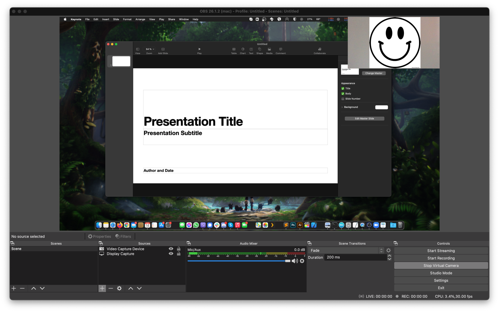

## How to Web-Present slides?

Zoom (or whatever client) proposes to show slides by sharing your screen. Unfortunately, this solution is subject to lag, poor video quality due to the stream compression and specifically, low framerate.
To overcome this limitation, the main idea here is to use OBS to record the screen and the sound, then create a *stream* on-the-fly that can be injected in Zoom or Skype as a virtual camera. 

This setup has been tested for a PhD defense using a macOS, similar setups could probably be used on Windows or Linux.

The tutorial will show how to

* present slides on a Zoom/Skype/Camera-based meeting
* embed a laptop/external camera in the presentation video
* live-record the presentation directly on the computer
* live-streaming the presentation directly from the computer (e.g. on Twitch)
* change the point of view of the video depending of the situation (e.g. presenting slides, answering questions, etc)
* embed external audio sources in real time in the video

### 1. Prerequisites

* Install [OBS](https://obsproject.com/fr) (free and open source) on your computer

We are interested only by 5 areas in OBS:

* A (blue): `Viewport` gives a preview of the video stream
* B (red): `Scenes` panel allows to quickly change OBS configuration
* C (green): `Sources` panel allows to add/remove audio/video sources
* D (yellow): `Audio Mixer` panel allows to tune audio sources
* E (purple): `Controls` panel access specific options

### 2. The basic: Capturing the screen
To visualize the screen, first add (if not already added) a new `Display Capture` source.
After choosing the name of the source, we are faced with the properties window.
Specifically, the option `Display` allows to select which screen we want to record, e.g. `0` for the internal screen of a laptop, `1` for an external monitor, and so on (Restart OBS when connecting new monitors).

The recorded screen shoud now be visible in the viewport of OBS. Moving the mouse cursor to one of the sides of the source video in the viewport allows to resize the source. (Doing so will add black borders to the stream).

Multiple `Display Capture` sources can be added at the same time by doing the same process.

### 3. Live presenting: virtual camera

To present the screen capture in a meeting, we need to create a video stream.
To do that, we first need to start the OBS virtual camera in the `Controls` panel by clicking on `Start Virtual Camera`.

Once the virtual camera is started, it can now be chosen from Zoom or Skype in their respective menus.

### 4. Embedding a camera in the stream

While presenting, it might be useful to embed the live video from a camera to show the presenter in real time in a corner for example.

First add a new `Video Capture Device` source in the `Sources` panel. The properties window allows to select the input device with the option `Device`.

Once the new source is added to viewport, it can also be resized and moved.

Filters can be applied on any video source to apply, for example, a mask. This can be useful if you want to show only the presenter face and remove/blur the background for privacy reasons.
Right click on the new `Video Capture Device` source and select `Filters` in the context menu. 

Add a new filter `Image Mask/Blend` in `Effect Filters` section.
This filter asks for a mask image (a simple black and white png for example) and a mask color (transparency can also be chosen).

Below is the result with a white circle on a black square mask illustrated just above (feel free to copy the mask image).

### 5. Live recording and live streaming the presentation

The video stream can be recorded and streamed in real time on different plateforms.

##### Live Recording
Click on `Start Recording` in the `Controls` panel to create a video file of your presentation on your computer. 
By default OBS save the video in the macOS `Videos` folder as a Matroska (.mkv) file. Go in OBS preferences to personnalize recording settings (`preferences > output`).

##### Live Streaming
Live streaming can be starting by clicking on `Start Streaming` on the `Controls` panel. 
Beware of configuring the streaming settings in OBS before (`preferences > stream`), using a stream key that can be obtained from the plateform account settings.

### 6. Embedding external audio sources in the stream

The video stream includes by default the default input source of the computer as `Mic/Aux` in the `Audio Mixer` panel, you can optionnaly add new audio sources by adding a new `Audio Input Capture` in the `Sources` panel.

In some case, include the audio from another source in the stream can be useful. For example, embedding the zoom audio output from the jury members of a PhD defense in the Twitch live-stream.

To do that, a specific tool to redirect the audio output of an app (e.g. Zoom.app) as new "virtual" input source must be used.
Then, we just need to add a new `Audio Input Capture` capturing that new input source in OBS.

[LoopBack](https://rogueamoeba.com/loopback/) is pretty simple to use to do that but is $119USD (free trial available).
macOS embeds the `Audio Midi Setup` tool that should theoretically be able to do the same thing.

### 7. Switching OBS scenes

OBS scenes allow to quickly change one video/audio configuration to another in OBS (in the `Scenes` panel).
This can be useful during a PhD defense to switch between a view on the slide + presenter cropped to a simple view of the presenter.
Changing the scene is captured by the virtual camera, plateforms streamings and recordings.

Switching OBS scenes can be done manually by clicking on the scene.
A keyboard shortcut can also be associated to that function in the OBS preferences (`preferences > hotkeys > Scene > Switch to scene`). (Beware of allowing OBS to record keyboard in the macOS accessibility preferences)
